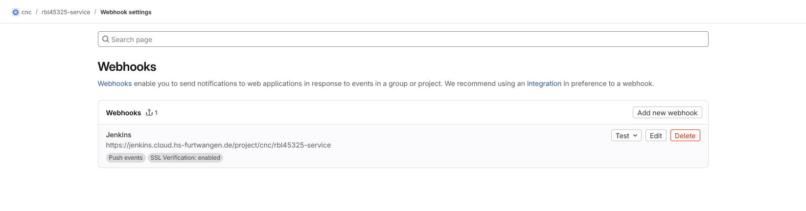
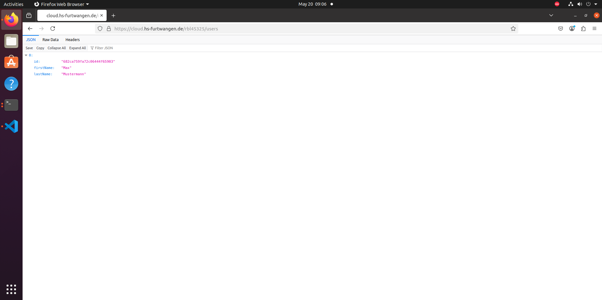

```markdown
---
**Rouven Bleich**

# Praktikum 2 – Container

---

## 1. Ubuntu-Container: Ausführen, Starten und Logs abrufen

### a) Container starten und Nachricht ausgeben
```bash
r3dbyrd@ubuntu:~/Desktop/service$ docker run --name ubuntu-test ubuntu echo "Cloud Native Computing"
Cloud Native Computing
```

### b) Container erneut starten
```bash
r3dbyrd@ubuntu:~/Desktop/service$ docker start ubuntu-test
ubuntu-test
r3dbyrd@ubuntu:~/Desktop/service$ docker start ubuntu-test
ubuntu-test
```

### c) Logs des Containers abrufen
```bash
r3dbyrd@ubuntu:~/Desktop/service$ docker logs ubuntu-test
Cloud Native Computing
Cloud Native Computing
Cloud Native Computing
r3dbyrd@ubuntu:~/Desktop/service$
```

### d) Container entfernen
```bash
r3dbyrd@ubuntu:~/Desktop/service$ docker rm ubuntu-test
ubuntu-test
```

---

## 2. Container "hello": Starten und Server-Informationen abrufen

### a) Container starten
```bash
r3dbyrd@ubuntu:~/Desktop/service$ docker run -d --name hello -p 9090:80 nginxdemos/hello
```

### b) Abgerufene Server-Informationen
```
Server address: 172.17.0.2:80
Server name: e9733eb1580c
Date: 04/Apr/2025:19:03:23 +0000
URI: /
See 'docker run --help'.
```

---

## 3. Container "hello": Stoppen und Entfernen
```bash
r3dbyrd@ubuntu:~/Desktop/service$ docker stop hello
hello
r3dbyrd@ubuntu:~/Desktop/service$ docker rm hello
hello
r3dbyrd@ubuntu:~/Desktop/service$
```

---

## 4. Nginx-Container mit Bind-Mount starten
```bash
r3dbyrd@ubuntu:~/Desktop/service$ docker run -d --name mynginx -p 9090:80 -v "$(pwd)/myweb":/usr/share/nginx/html:ro nginx
```

---

## 5. Screenshot der Webseite


---

# Praktikum 3 – Container

## Teil 1: Einfacher Ubuntu-Container mit figlet

### a) Dockerfile erstellen
```dockerfile
FROM ubuntu:latest
RUN apt-get update && apt-get install -y figlet
ENTRYPOINT ["figlet", "-f", "slant"]
CMD ["Cloud Native Computing"]
```

### b) Image bauen
```bash
r3dbyrd@ubuntu:~/Desktop/service$ docker build -t myfiglet .
[+] Building 15.4s (6/6) FINISHED                                docker:default
 => [internal] load build definition from Dockerfile                       0.0s
 => => transferring dockerfile: 174B                                       0.0s
 => [internal] load metadata for docker.io/library/ubuntu:latest           0.0s
 => [internal] load .dockerignore                                          0.0s
 => => transferring context: 2B                                            0.0s
 => CACHED [1/2] FROM docker.io/library/ubuntu:latest                      0.0s
 => [2/2] RUN apt-get update && apt-get install -y figlet                 14.9s
 => exporting to image                                                     0.3s 
 => => exporting layers                                                    0.3s 
 => => writing image sha256:0822ab1ceeadeb8fa0db17287321cd99385b616069d0c  0.0s 
 => => naming to docker.io/library/myfiglet                                0.0s 
r3dbyrd@ubuntu:~/Desktop/service$
```

### c) Container ausführen
```bash
r3dbyrd@ubuntu:~/Desktop/service$ docker run --rm myfiglet
   ________                __   _   __      __  _
  / ____/ /___  __  ______/ /  / | / /___ _/ /_(_)   _____
 / /   / / __ \/ / / / __  /  /  |/ / __ `/ __/ / | / / _ \
/ /___/ / /_/ / /_/ / /_/ /  / /|  / /_/ / /_/ /| |/ /  __/
\____/_/\____/\__,_/\__,_/  /_/ |_/\__,_/\__/_/ |___/\___/

   ______                            __  _
  / ____/___  ____ ___  ____  __  __/ /_(_)___  ____ _
 / /   / __ \/ __ `__ \/ __ \/ / / / __/ / __ \/ __ `/
/ /___/ /_/ / / / / / / /_/ / /_/ / /_/ / / / / /_/ /
\____/\____/_/ /_/ /_/ .___/\__,_/\__/_/_/ /_/\__, /
                    /_/                      /____/
r3dbyrd@ubuntu:~/Desktop/service$
```

---

## Teil 2: Service-Image mit JIB erstellen und in die Registry pushen

### a) JIB-Plugin in pom.xml integrieren
```xml
<plugin>
  <groupId>com.google.cloud.tools</groupId>
  <artifactId>jib-maven-plugin</artifactId>
  <version>3.3.2</version>
  <configuration>
    <to>
      <image>registry.cloud.hs-furtwangen.de/cnc/rbl45325-service</image>
    </to>
  </configuration>
</plugin>
```

### b) Docker Login
```bash
r3dbyrd@ubuntu:~/Desktop/service$ docker login -u Rouven_Leon_Bleich registry.cloud.hs-furtwangen.de
Password: 
WARNING! Your password will be stored unencrypted in /home/r3dbyrd/.docker/config.json.
Configure a credential helper to remove this warning. See
https://docs.docker.com/engine/reference/commandline/login/#credentials-store
Login Succeeded
```

### c) Maven Build & Push des Service-Images
```bash
r3dbyrd@ubuntu:~/Desktop/service$ mvn compile jib:build -D"image=registry.cloud.hs-furtwangen.de/cnc/rbl45325-service"
...
[INFO] Containerizing application to registry.cloud.hs-furtwangen.de/cnc/rbl45325-service...
[WARNING] Base image 'eclipse-temurin:17-jre' does not use a specific image digest - build may not be reproducible
...
Digest: sha256:c5451570245c0903eda2508cb6178485e6827549499935542a27a788b49e4353
...
```

### d) Image Pull
```bash
r3dbyrd@ubuntu:~/Desktop/service$ docker pull registry.cloud.hs-furtwangen.de/cnc/rbl45325-service
Using default tag: latest
latest: Pulling from cnc/rbl45325-service
2726e237d1a3: Pull complete 
26eb7a286e7c: Pull complete 
ff98e09c72e1: Pull complete 
1c75f759c134: Pull complete 
7a0d9be831da: Pull complete 
7f224287afef: Pull complete 
12812c5fbb64: Pull complete 
b61151d982fd: Pull complete 
be8e2e62a29a: Pull complete 
Digest: sha256:c5451570245c0903eda2508cb6178485e6827549499935542a27a788b49e4353
Status: Downloaded newer image for registry.cloud.hs-furtwangen.de/cnc/rbl45325-service:latest
registry.cloud.hs-furtwangen.de/cnc/rbl45325-service:latest
```

### e) Container ausführen mit Port-Mapping
```bash
r3dbyrd@ubuntu:~/Desktop/service$ docker run --rm -p 8080:8080 registry.cloud.hs-furtwangen.de/cnc/rbl45325-service:latest
  .   ____          _            __ _ _
 /\\ / ___'_ __ _ _(_)_ __  __ _ \ \ \ \
( ( )\___ | '_ | '_| | '_ \/ _` | \ \ \ \
 \\/  ___)| |_)| | | | | || (_| |  ) ) ) )
  '  |____| .__|_| |_|_| |_\__, | / / / /
 =========|_|==============|___/=/_/_/_/

 :: Spring Boot ::                (v3.4.4)
```

---
```

# Praktikum 4 – Orchestrierung

## Schritt 5: Deployment „rbl45325-pingpong“ erstellen

```bash
$ kubectl create deployment rbl45325-pingpong \
    --image=jpetazzo/ping \
    --replicas=3
deployment.apps/rbl45325-pingpong created
```

## Schritt 6: Replica auf 1 reduzieren und Pods anzeigen

```bash
$ kubectl scale deployment rbl45325-pingpong --replicas=1
deployment.apps/rbl45325-pingpong scaled
$ kubectl get pods
NAME                                 READY   STATUS             RESTARTS        AGE
dhu47652-pingpong-5d567c57b5-kn8cx   1/1     Running            0               92m
dpe49141-pingpong-6cbd6b9fc6-sp6t5   1/1     Running            0               84m
dpe49141-service-5487479899-cvpzk    0/1     CrashLoopBackOff   7 (2m22s ago)   34m
ksc52508-pingpong-84559fdc49-v9gp7   1/1     Running            0               82m
mhe49627-pingpong-d779f94cb-jtfm6    1/1     Running            0               97m
mhu44525-pingpong-6f95cb9654-p89cb   1/1     Running            0               97m
mju41480-pingpong-578f5495d5-5225l   1/1     Running            0               17m
mpu48377-pingpong-b88d56dbf-vwj9m    1/1     Running            0               63m
mpu48377-service-6d9ffd9744-njgr4    1/1     Running            0               51m
nmu45475-pingpong-5b59686975-67vkk   1/1     Running            0               31m
rbl45325-pingpong-ff5dfd887-94w4z    1/1     Running            0               2m48s
rgl51076-pingpong-5c6c9db668-7zx6z   1/1     Running            0               95m
```

## Schritt 7: Deployment „rbl45325-service“ erstellen und Pods prüfen

```bash
$ kubectl create deployment rbl45325-service \
    --image=registry.cloud.hs-furtwangen.de/cnc/rbl45325-service:latest \
    --replicas=1
deployment.apps/rbl45325-service created

$ kubectl get pods
NAME                                 READY   STATUS             RESTARTS       AGE
dhu47652-pingpong-5d567c57b5-kn8cx   1/1     Running            0              101m
dpe49141-pingpong-6cbd6b9fc6-sp6t5   1/1     Running            0              93m
dpe49141-service-5487479899-cvpzk    0/1     CrashLoopBackOff   9 (102s ago)   44m
jsc45227-pingpong-7998c4c4d8-9vkg7   1/1     Running            0              4m39s
jsc45227-pingpong-7998c4c4d8-crnrw   1/1     Running            0              4m39s
jsc45227-pingpong-7998c4c4d8-qhvbk   1/1     Running            0              4m39s
ksc52508-pingpong-84559fdc49-v9gp7   1/1     Running            0              91m
mhe49627-pingpong-d779f94cb-jtfm6    1/1     Running            0              106m
mhu44525-pingpong-6f95cb9654-p89cb   1/1     Running            0              106m
mju41480-pingpong-578f5495d5-5225l   1/1     Running            0              27m
mpu48377-pingpong-b88d56dbf-vwj9m    1/1     Running            0              72m
mpu48377-service-6d9ffd9744-njgr4    1/1     Running            0              61m
nmu45475-pingpong-5b59686975-67vkk   1/1     Running            0              40m
rbl45325-pingpong-ff5dfd887-94w4z    1/1     Running            0              12m
rbl45325-service-6878dc8f79-kkjs2    1/1     Running            0              15s
rgl51076-pingpong-5c6c9db668-7zx6z   1/1     Running            0              105m
```

## Schritt 8: Details zum Service-Pod

```bash
$ kubectl describe pod rbl45325-service-6878dc8f79-kkjs2
IP:               10.244.5.18

Conditions:
  Type                        Status
  PodReadyToStartContainers   True 
  Initialized                 True 
  Ready                       True 
  ContainersReady             True 
  PodScheduled                True 

Events:
  Type    Reason     Age   From               Message
  Normal  Scheduled  89s   default-scheduler  Successfully assigned cnc/rbl45325-service-6878dc8f79-kkjs2 to cloud2
  Normal  Pulling    89s   kubelet            Pulling image "registry.cloud.hs-furtwangen.de/cnc/rbl45325-service:latest"
  Normal  Pulled     86s   kubelet            Successfully pulled image "registry.cloud.hs-furtwangen.de/cnc/rbl45325-service:latest" in 2.493s (2.493s including waiting). Image size: 112125827 bytes.
  Normal  Created    86s   kubelet            Created container: rbl45325-service
  Normal  Started    86s   kubelet            Started container rbl45325-service
```

## Schritt 9: Service-Deployment löschen

```bash
$ kubectl delete deployment rbl45325-service
deployment.apps "rbl45325-service" deleted

$ kubectl get pods
NAME                                 READY   STATUS             RESTARTS        AGE
dhu47652-pingpong-5d567c57b5-kn8cx   1/1     Running            0               105m
dpe49141-pingpong-6cbd6b9fc6-sp6t5   1/1     Running            0               96m
dpe49141-service-5487479899-cvpzk    0/1     CrashLoopBackOff   9 (4m51s ago)   47m
jsc45227-pingpong-7998c4c4d8-crnrw   1/1     Running            0               7m48s
ksc52508-pingpong-84559fdc49-v9gp7   1/1     Running            0               94m
mhe49627-pingpong-d779f94cb-jtfm6    1/1     Running            0               110m
mhu44525-pingpong-6f95cb9654-p89cb   1/1     Running            0               109m
mju41480-pingpong-578f5495d5-5225l   1/1     Running            0               30m
mpu48377-pingpong-b88d56dbf-vwj9m    1/1     Running            0               75m
mpu48377-service-6d9ffd9744-njgr4    1/1     Running            0               64m
nmu45475-pingpong-5b59686975-67vkk   1/1     Running            0               43m
rbl45325-pingpong-ff5dfd887-94w4z    1/1     Running            0               15m
rgl51076-pingpong-5c6c9db668-7zx6z   1/1     Running            0               108m
```
```

````
## Aufgabe 5

### Pod starten

```bash
kubectl apply -f src/kubernetes/pod.yaml
````

### Pod-Status prüfen

```bash
kubectl describe pod rbl45325-service
```

```
Name:             rbl45325-service
Namespace:        cnc
Priority:         0
Service Account:  default
Node:             cloud3/141.28.66.13
Start Time:       Tue, 06 May 2025 01:21:29 -0700
Status:           Running
IP:
IPs:
Containers:
  rbl45325-service:
    Container ID:   containerd://d4b746ce99b6ef62bf69a04d62ed726757b99c53fa09132910bd01d45340d22c
    Image:          registry.cloud.hs-furtwangen.de/cnc/rbl45325-service:latest
    Image ID:       registry.cloud.hs-furtwangen.de/cnc/rbl45325-service@sha256:c5451570245c0903eda2508cb6178485e6827549499935542a27a788b49e4353
    State:          Running
      Started:      Tue, 06 May 2025 01:25:11 -0700
    Ready:          True
    Restart Count:  0
    Limits:
      cpu:     1
      memory:  256Mi
    Requests:
      cpu:        100m
      memory:     32Mi
    Liveness:      http-get http://:8080/actuator/health/liveness delay=15s timeout=1s period=10s #success=1 #failure=3
    Readiness:     http-get http://:8080/actuator/health/readiness delay=15s timeout=1s period=10s #success=1 #failure=3
QoS Class:        Burstable
```

### Liveness-Check lokal

```bash
kubectl port-forward pod/rbl45325-service 8080:8080
```

Browser-Aufruf:

```
http://localhost:8080/actuator/health/liveness
```

<p align="center">
  
</p>

```json
{"status":"UP"}
```
## Praktikum 6 – Ingress & Host-Endpoint

<p align="center">
  
</p>

<p align="center">
  
</p>

## Praktikum 7 – Logging & Observability

<p align="center">
  
</p>

<p align="center">
  
</p>

<p align="center">
  
</p>

<p align="center">
  
</p>

<p align="center">
  
</p>

```bash
kubectl logs -l author=rbl45325 --tail=100

  .   ____          _            __ _ _
 /\\ / ___'_ __ _ _(_)_ __  __ _ \ \ \ \
( ( )\___ | '_ | '_| | '_ \/ _` | \ \ \ \
 \\/  ___)| |_)| | | | | || (_| |  ) ) ) )
  '  |____| .__|_| |_|_| |_\__, | / / / /
 =========|_|==============|___/=/_/_/_/

 :: Spring Boot ::                (v3.4.4)

2025-05-18T17:01:25.735Z  INFO 1 --- [service] [           main] de.hfu.cnc.ServiceApplication            : Starting ServiceApplication using Java 17.0.15 with PID 1 (/app/classes started by root in /)
2025-05-18T17:01:25.766Z  INFO 1 --- [service] [           main] de.hfu.cnc.ServiceApplication            : No active profile set, falling back to 1 default profile: "default"
2025-05-18T17:01:29.830Z  INFO 1 --- [service] [           main] o.s.b.w.embedded.tomcat.TomcatWebServer  : Tomcat initialized with port 8080 (http)
2025-05-18T17:01:29.839Z  INFO 1 --- [service] [           main] o.apache.catalina.core.StandardService   : Starting service [Tomcat]
2025-05-18T17:01:29.840Z  INFO 1 --- [service] [           main] o.apache.catalina.core.StandardEngine    : Starting Servlet engine: [Apache Tomcat/10.1.39]
2025-05-18T17:01:29.968Z  INFO 1 --- [service] [           main] o.a.c.c.C.[.[localhost].[/rbl45325]      : Initializing Spring embedded WebApplicationContext
2025-05-18T17:01:29.969Z  INFO 1 --- [service] [           main] w.s.c.ServletWebServerApplicationContext : Root WebApplicationContext: initialization completed in 3839 ms
2025-05-18T17:01:30.536Z  INFO 1 --- [service] [           main] de.hfu.cnc.ServiceApplication            : ServiceApplication initialized; counter='service_requests' registered
2025-05-18T17:01:31.929Z  INFO 1 --- [service] [           main] o.s.b.a.e.web.EndpointLinksResolver      : Exposing 3 endpoints beneath base path '/actuator'
2025-05-18T17:01:32.078Z  INFO 1 --- [service] [           main] o.s.b.w.embedded.tomcat.TomcatWebServer  : Tomcat started on port 8080 (http) with context path '/rbl45325'
2025-05-18T17:01:32.140Z  INFO 1 --- [service] [           main] de.hfu.cnc.ServiceApplication            : Started ServiceApplication in 7.977 seconds (process running for 8.47)
2025-05-18T17:01:40.910Z  INFO 1 --- [service] [nio-8080-exec-1] o.a.c.c.C.[.[localhost].[/rbl45325]      : Initializing Spring DispatcherServlet 'dispatcherServlet'
2025-05-18T17:01:40.911Z  INFO 1 --- [service] [nio-8080-exec-1] o.s.web.servlet.DispatcherServlet        : Initializing Servlet 'dispatcherServlet'
2025-05-18T17:01:40.912Z  INFO 1 --- [service] [nio-8080-exec-1] o.s.web.servlet.DispatcherServlet        : Completed initialization in 1 ms

```

## Praktikum 8 - Jenkins

```bash
r3dbyrd@ubuntu:~/Desktop/service$ helm install rbl45325-service ./src/charts/service
NAME: rbl45325-service
LAST DEPLOYED: Mon May 19 03:10:59 2025
NAMESPACE: cnc
STATUS: deployed
REVISION: 1
TEST SUITE: None
r3dbyrd@ubuntu:~/Desktop/ser
```
<p align="center">
  
</p>
<p align="center">
  
</p>

```bash
r3dbyrd@ubuntu:~/Desktop/service$ skaffold dev
Generating tags...
 - registry.cloud.hs-furtwangen.de/cnc/rbl45325-service -> registry.cloud.hs-furtwangen.de/cnc/rbl45325-service:f51ddc7-dirty
Checking cache...
 - registry.cloud.hs-furtwangen.de/cnc/rbl45325-service: Found Remotely
Tags used in deployment:
 - registry.cloud.hs-furtwangen.de/cnc/rbl45325-service -> registry.cloud.hs-furtwangen.de/cnc/rbl45325-service:f51ddc7-dirty@sha256:24fd251f473cab394ed93557fa6732631726cbb2ef48e36576a1e492bda77b98
Starting deploy...
Helm release rbl45325-service not installed. Installing...
NAME: rbl45325-service
LAST DEPLOYED: Mon May 19 13:42:22 2025
NAMESPACE: cnc
STATUS: deployed
REVISION: 1
TEST SUITE: None
Waiting for deployments to stabilize...
 - cnc:deployment/rbl45325-service: waiting for rollout to finish: 0 of 3 updated replicas are available...
 - pods: pods not ready: [rbl45325-service]
 - pods is ready. [1/2 deployment(s) still pending]
 - cnc:deployment/rbl45325-service is ready.
Deployments stabilized in 23.431 seconds
Listing files to watch...
 - registry.cloud.hs-furtwangen.de/cnc/rbl45325-service
Press Ctrl+C to exit
Watching for changes...
...
[service] 
[service]   .   ____          _            __ _ _
[service]  /\\ / ___'_ __ _ _(_)_ __  __ _ \ \ \ \
[service] ( ( )\___ | '_ | '_| | '_ \/ _` | \ \ \ \
[service]  \\/  ___)| |_)| | | | | || (_| |  ) ) ) )
[service]   '  |____| .__|_| |_|_| |_\__, | / / / /
[service]  =========|_|==============|___/=/_/_/_/
[service] 
[service]  :: Spring Boot ::                (v3.4.4)
[service] 
[service] 2025-05-19T20:42:28.340Z  INFO 1 --- [service] [           main] de.hfu.cnc.ServiceApplication            : Starting ServiceApplication using Java 17.0.15 with PID 1 (/app/classes started by root in /)
[service] 2025-05-19T20:42:28.345Z  INFO 1 --- [service] [           main] de.hfu.cnc.ServiceApplication            : No active profile set, falling back to 1 default profile: "default"
[service] 2025-05-19T20:42:33.320Z  INFO 1 --- [service] [           main] o.s.b.w.embedded.tomcat.TomcatWebServer  : Tomcat initialized with port 8080 (http)
[service] 2025-05-19T20:42:33.340Z  INFO 1 --- [service] [           main] o.apache.catalina.core.StandardService   : Starting service [Tomcat]
[service] 2025-05-19T20:42:33.341Z  INFO 1 --- [service] [           main] o.apache.catalina.core.StandardEngine    : Starting Servlet engine: [Apache Tomcat/10.1.39]
[service] 2025-05-19T20:42:33.436Z  INFO 1 --- [service] [           main] o.a.c.c.C.[.[localhost].[/rbl45325]      : Initializing Spring embedded WebApplicationContext
[service] 2025-05-19T20:42:33.437Z  INFO 1 --- [service] [           main] w.s.c.ServletWebServerApplicationContext : Root WebApplicationContext: initialization completed in 4700 ms
[service] 2025-05-19T20:42:33.946Z  INFO 1 --- [service] [           main] de.hfu.cnc.ServiceApplication            : ServiceApplication initialized; counter='service_requests' registered
[service] 2025-05-19T20:42:35.598Z  INFO 1 --- [service] [           main] o.s.b.a.e.web.EndpointLinksResolver      : Exposing 3 endpoints beneath base path '/actuator'
[service] 2025-05-19T20:42:35.938Z  INFO 1 --- [service] [           main] o.s.b.w.embedded.tomcat.TomcatWebServer  : Tomcat started on port 8080 (http) with context path '/rbl45325'
[service] 2025-05-19T20:42:36.002Z  INFO 1 --- [service] [           main] de.hfu.cnc.ServiceApplication            : Started ServiceApplication in 9.64 seconds (process running for 10.438)
[service] 2025-05-19T20:42:44.647Z  INFO 1 --- [service] [nio-8080-exec-1] o.a.c.c.C.[.[localhost].[/rbl45325]      : Initializing Spring DispatcherServlet 'dispatcherServlet'
[service] 2025-05-19T20:42:44.648Z  INFO 1 --- [service] [nio-8080-exec-1] o.s.web.servlet.DispatcherServlet        : Initializing Servlet 'dispatcherServlet'
[service] 2025-05-19T20:42:44.649Z  INFO 1 --- [service] [nio-8080-exec-1] o.s.web.servlet.DispatcherServlet        : Completed initialization in 1 ms
^CCleaning up...
release "rbl45325-service" uninstalled

r3dbyrd@ubuntu:~/Desktop/service$ 
```
<p align="center">
  
</p>

## Praktikum 9 - MongoDB

```bash
r3dbyrd@ubuntu:~/Desktop/rbl45325-service$ curl -X POST https://cloud.hs-furtwangen.de/rbl45325/users -H "Content-Type: application/json" -d '{"firstName":"Max","lastName":"Mustermann"}'
r3dbyrd@ubuntu:~/Desktop/rbl45325-service$
```

<p align="center">
  
</p>


## Praktikum 10


<p align="center">
  
</p>
<p align="center">
  
</p>

